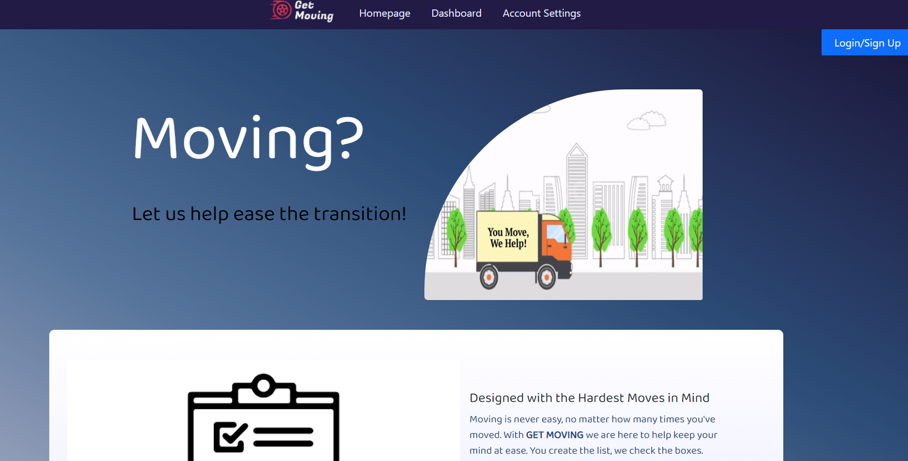

 
# <header>Get Moving!</header>
## 
## Contents
- [Description](#description)
- [Installation](#installation)
- [Usage](#usage)
- [Contributions](#contributions)
- [Testing](#testing)
- [Contact](#contact)
- [Link](#link)
## Description
As a user preparing to move from Point A to Point B, we provide you with the most important part of your transition: keeping yourself organized. Keep track of your packing lists and other moving details, starting with our suggestions and creating custom lists of your own. 
## Installation
You can go to our website linked below! If you'd like to use this as a baseline for your own project, just clone this repo and download the dependencies listed in the package.json file. 
## Usage
This project shows a front-end experience created with React and how it can communicate with a MongoDB, Express, GraphQL, and Node back-end. 
## License
   Application is backed by MIT license.
## Contributions
This project was created by John Grant, Julia Johnson, Mary Greenwood, Michael Smitte, Shawn Thomas, and Josh Icard. 
## Contact
Check out my GitHub profile! [jicard](https://github.com/jicard)
 
Contact me via email @ icardj@outlook.com
## Link
[Heroku Link](https://projectthreemern.herokuapp.com/)

